```mermaid
graph LR
    A[Q1 2025] --> B[Complete AI Diploma]
    B --> C[AWS Certification]
    C --> D[Q2 2025]
    D --> E[Open Source Contributions]
    E --> F[MLOps Projects]
    F --> G[Q3 2025]
    G --> H[Advanced Deep Learning]
    H --> I[Production ML Systems]
    I --> J[Q4 2025]
    J --> K[Lead AI Projects]
    
    style A fill:#ff6b6b
    style D fill:#4ecdc4
    style G fill:#45b7d1
    style J fill:#96ceb4
```

# <div align="center">👋 Hello World, I'm **Sabry Mohamed AlaaEldin**</div>

<div align="center">
  
</div>

<div align="center">
  
</div>

---

<div align="center">
  
</div>

## 🚀 **About Me**

<div align="center">
  
</div>

<br>

<div align="center">
  
```python
class SabryAlaaeldin:
    def __init__(self):
        self.name = "Sabry Mohamed Alaaeldin"
        self.role = "AI & Data Science Engineer"
        self.location = "Egypt 🇪🇬"
        self.languages = ["Arabic", "English"]
        self.passions = [
            "Machine Learning", 
            "Data Science", 
            "Software Development",
            "Deep Learning",
            "Computer Vision"
        ]
        self.currently_learning = [
            "Advanced Deep Learning", 
            "MLOps & DevOps", 
            "Cloud Computing (AWS)",
            "Generative AI"
        ]
        self.goals_2025 = [
            "Master Large Language Models",
            "Build Production ML Systems",
            "Contribute to Open Source",
            "Get AWS Certification"
        ]
        
    def say_hi(self):
        print("Thanks for dropping by! Let's build something amazing together 🚀")
        return "Ready to innovate! 💡"

# Initialize and greet
me = SabryAlaaeldin()
me.say_hi()
```

</div>

---

## 🛠️ **Tech Stack & Tools**

<div align="center">

### **Programming Languages**


</div>

<div align="center">

### **AI/ML & Data Science**


</div>

<div align="center">

### **Development Tools & Frameworks**


</div>

<div align="center">

### **Databases & Cloud**


</div>

<div align="center">

### **Data Visualization & Analytics**


</div>

---

## 📊 **GitHub Analytics**

<div align="center">
  
### **📈 Profile Summary**


</div>

<div align="center">

### **🔥 GitHub Statistics**


</div>

<div align="center">

### **💻 Language Analytics**


</div>

<div align="center">

### **🏆 GitHub Trophies**


</div>

---

<div align="center">
  
</div>

## 🏆 **Featured Projects**

<div align="center">
  
</div>

<br>

<div align="center">
  
### 🎬 **Netflix Data Analytics Dashboard**
[](https://github.com/SabryAlaa10/Netflix-Users-Analysis)


📊 **Comprehensive analysis platform for Netflix content and user engagement**
- 🔍 Advanced data exploration with interactive visualizations
- 📈 Predictive analytics for content performance and user behavior
- 🎯 Strategic insights dashboard for content optimization
- 📱 Responsive web interface with real-time analytics

**Tech Stack:** `Python` `Pandas` `Matplotlib` `Seaborn` `Streamlit` `Plotly`

---

### 💰 **Smart Income Prediction Engine**
[](https://github.com/SabryAlaa10/Adult_income-Logistic-Regression)


🤖 **Advanced ML model for income classification with 94% accuracy**
- 🎯 High-precision income bracket prediction system
- 📊 Automated feature engineering and selection pipeline
- 🔧 Model interpretability with SHAP values
- 🚀 RESTful API deployment with Flask

**Tech Stack:** `Scikit-learn` `Python` `Jupyter` `Pandas` `Flask` `SHAP`

---

### 🔄 **AI-Powered Customer Churn Predictor**
[](https://github.com/SabryAlaa10/-Customer-Churn-Prediction)


📉 **End-to-end ML solution for customer retention optimization**
- 🎯 Multi-model ensemble for enhanced prediction accuracy
- 📊 Real-time dashboard with customer risk scoring
- 💼 Business impact calculator and ROI analysis
- 🔔 Automated alert system for high-risk customers

**Tech Stack:** `TensorFlow` `Python` `Streamlit` `Plotly` `SQLite` `Docker`

---

### 🏠 **Airbnb Intelligent Pricing System**
[](https://github.com/SabryAlaa10/Airbnb-Prediction-Model)


🏡 **AI-driven dynamic pricing optimization for property rentals**
- 💡 Smart pricing recommendations using XGBoost
- 🗺️ Geospatial analysis with location intelligence
- 📅 Seasonal demand forecasting and trend analysis
- 🚀 Full-stack web application with CI/CD pipeline

**Tech Stack:** `XGBoost` `Flask` `Docker` `PostgreSQL` `Folium` `AWS`

---

### 🛒 **E-Commerce Intelligence Platform**
[](https://github.com/SabryAlaa10/Pakistan-s-Largest-E-Commerce-Dataset)


📈 **Comprehensive business intelligence solution for e-commerce**
- 📊 Interactive Power BI dashboards with KPI monitoring
- 🛍️ Advanced customer segmentation using clustering
- 💰 Revenue optimization through market basket analysis
- 🔮 Sales forecasting with time series analysis

**Tech Stack:** `Power BI` `SQL Server` `Python` `DAX` `Azure`

---

### ⚽ **European Soccer Analytics Engine**
[](https://github.com/SabryAlaa10/European-Soccer-Database)


⚽ **Advanced sports analytics platform with predictive modeling**
- 🏆 Player performance evaluation using machine learning
- 📊 Team strategy analysis and tactical insights
- 🎯 Match outcome prediction with ensemble methods
- 💸 Transfer market valuation and trend analysis

**Tech Stack:** `Python` `SQL` `Matplotlib` `SQLite` `Scikit-learn` `Tableau`

</div>

---

<div align="center">
  
</div>

## 🏅 **Certifications & Achievements**

<div align="center">
  
</div>

<br>

<table align="center">
  <thead>
    <tr>
      <th>🎓 <strong>Certification</strong></th>
      <th>🏢 <strong>Institution</strong></th>
      <th>📅 <strong>Year</strong></th>
      <th>🌟 <strong>Status</strong></th>
      <th>🔗 <strong>Verify</strong></th>
    </tr>
  </thead>
  <tbody>
    <tr>
      <td align="center"><strong>💼 Freelancing Fundamentals</strong></td>
      <td>Mahara Tech</td>
      <td>2024</td>
      <td></td>
      <td><a href="https://www.linkedin.com/posts/sabry-mohmmed-56a5b4320_i-am-thrilled-to-announce-that-i-have-earned-activity-7223675721410351105-yHf1?utm_source=share&utm_medium=member_desktop&rcm=ACoAAFE_FSIBAVNFPqpq5eAN91eZiEPk-yqb0sA"></a></td>
    </tr>
    <tr>
      <td align="center"><strong>☕ Java OOP & Git Fundamentals</strong></td>
      <td>Information Technology Institute (ITI)</td>
      <td>2024</td>
      <td></td>
      <td><a href="https://www.linkedin.com/posts/sabry-mohmmed-56a5b4320_java-oop-git-activity-7303124133075120128-il14?utm_source=share&utm_medium=member_desktop&rcm=ACoAAFE_FSIBAVNFPqpq5eAN91eZiEPk-yqb0sA"></a></td>
    </tr>
    <tr>
      <td align="center"><strong>🤖 Data Science & AI Professional Diploma</strong></td>
      <td>AMIT Learning Academy</td>
      <td>2025</td>
      <td></td>
      <td></td>
    </tr>
    <tr>
      <td align="center"><strong>☁️ AWS Cloud Practitioner</strong></td>
      <td>Amazon Web Services</td>
      <td>2025</td>
      <td></td>
      <td></td>
    </tr>
  </tbody>
</table>

---

## 📈 **GitHub Activity**

<div align="center">

### **⚡ Contribution Graph**


</div>

<div align="center">

### **🔥 Streak Stats**


</div>

---

## 🎵 **Developer Vibes**

<div align="center">
  <details>
    <summary><strong>🎧 Current Coding Soundtrack</strong></summary>
    <br>
    
> *"Good code is like good music - it has rhythm, structure, and tells a story"* 🎼

[](https://open.spotify.com/user/somnathpaul)
    
**🎶 Favorite Coding Genres:**
- Lofi Hip Hop 🎵
- Electronic/Synthwave 🎛️
- Classical/Piano 🎹
- Ambient/Focus Music 🌊

  </details>
</div>

---

## 🌐 **Let's Connect & Collaborate**

<div align="center">
  
</div>

<br>

<div align="center">

[](https://t.me/spxd007)
[](https://github.com/SabryAlaa10)
[](https://linkedin.com/in/sabry-alaaeldin)
[](mailto:sabryalaa10@gmail.com)
[](https://wa.me/201234567890)
[](https://discord.gg/yourdiscord)

</div>

<div align="center">

### **📬 Quick Contact**
💬 **Telegram**: [@spxd007](https://t.me/spxd007) - *Fastest response*  
📧 **Email**: [sabryalaa10@gmail.com](mailto:sabryalaa10@gmail.com) - *Professional inquiries*  
💼 **LinkedIn**: [Sabry AlaaEldin](https://linkedin.com/in/sabry-alaaeldin) - *Network & opportunities*  

</div>

---

## 📊 **Profile Metrics**

<div align="center">


</div>

---

## 🎯 **2025 Goals & Roadmap**

<div align="center">



</div>

---

<div align="center">
  
</div>

---

### 💡 **Developer Wisdom**
> *"Code is like humor. When you have to explain it, it's bad."* - Cory House 💻  
> *"The best way to predict the future is to implement it!"* - Alan Kay ✨  
> *"Debugging is twice as hard as writing the code. So make your code simple!"* 🐛

<div align="center">

**⚡ Fun Developer Facts:**
- ☕ Lines of code written: **50,000+**
- 🧠 Problems solved: **500+** 
- 📚 Technologies learned: **25+**
- 🚀 Projects deployed: **10+**
- 💡 Ideas implemented: **∞**

</div>

<div align="center">
  
  
  
  
</div>

<div align="center">
  
**Happy Coding! 🚀**

</div>
