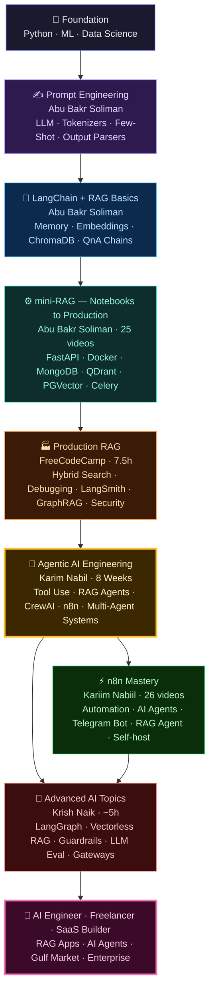

# <div align="center">👋 Hello World, I'm **Sabry Mohamed AlaaEldin**</div>

<div align="center">
  
</div>

<p align="center">


</p>

---


## 🚀 **About Me**

<div align="center">

```python
class SabryAlaaeldin:
    def __init__(self):
        self.name     = "Sabry Mohamed Alaaeldin"
        self.role     = "AI Automation & Agentic AI Engineer"
        self.location = "Egypt 🇪🇬"
        self.languages = ["Arabic", "English"]
        self.stack = {
            "agents":     ["n8n", "LangChain", "OpenAI API", "Gemini AI"],

            "rag":        ["FAISS", "pgvector", "Qdrant", "LangChain", "Pydantic"],

            "backend":    ["Python", "FastAPI", "Node.js", "PostgreSQL"],

            "frontend":   ["React", "Next.js", "Streamlit"],

            "mobile":     ["Kotlin", "Jetpack Compose"],

            "automation": ["n8n", "Make", "Webhooks", "API Integration"],

            "data":       ["Power BI", "Pandas", "Scikit-learn", "Plotly"]
        }
        self.currently_building = [
            "AI Secretary SaaS for Gulf Medical Clinics",
            "AI Lead Generation Pipeline (n8n + OpenAI + Next.js)",
            "SGU Student Guide RAG Chatbot (Production — Qdrant + n8n)",
            "RAG-based Legal AI Assistant"
        ]
        self.philosophy = "Build AI that works in production, not just demos."

    def say_hi(self):
        print("Let's build something that actually solves a real problem 🚀")

me = SabryAlaaeldin()
me.say_hi()
```

</div>

---

## 🛠️ **Tech Stack & Tools**

<div align="center">

### **🤖 AI & Automation**


### **⚙️ Backend & Databases**


### **🌐 Frontend & Mobile**


### **📊 ML & Data Science**


### **🔧 Tools & Platforms**


</div>

---

<br>

## 🏆 **Featured Projects**
 
<div align="center">
  
</div>
<br>
<div align="center">

---
### 🧠 **NeuroGuard AI — Stroke, Hemorrhage & Alzheimer's Decision Support**

> **🟡 Hackathon Project — 48-Hour Build, Working End-to-End Pipeline**

Multimodal clinical decision-support system helping ER physicians resolve a real, high-stakes dilemma: distinguishing acute ischemic stroke from Alzheimer's-related presentations before administering tPA — where the wrong call can cause fatal brain hemorrhage in patients with Cerebral Amyloid Angiopathy.

- 🧠 3 independently trained CV models run in parallel per scan — hemorrhage detection (RSNA dataset), stroke classification (YOLOv12, 92.4% mAP), Alzheimer's stage classification (86.1% accuracy)
- 📚 RAG layer grounded in the 2022 & 2026 AHA/ASA stroke guidelines — every claim cited, zero answers from outside knowledge
- ⚠️ Explicit cross-model conflict detection — flags disagreement between models instead of silently picking one
- 🖥️ Live ER dashboard with per-model confidence gauges, retrieved evidence, and physician sign-off step
- 🌐 End-to-end orchestration in n8n — image upload → 3 CV models → RAG retrieval → guideline-grounded clinical synthesis

**Stack:** `n8n` `Roboflow` `Qdrant` `OpenAI` `LangChain`

---
### 🩺 CDC Opioid Prescribing Guideline Assistant — Clinical RAG System
🟡 Hackathon Project — Grounded Clinical Q&A, Built for Accuracy Under Pressure
RAG chatbot answering clinician questions strictly from the 2022 CDC Opioid Prescribing Guideline (Dowell et al.) — structure-aware chunking, verified citations, and explicit scope enforcement for excluded populations (pediatric, cancer, sickle cell, palliative care).

* 🧠 Structure-aware ingestion pipeline (PDF → clean Markdown → metadata-tagged chunks by Recommendation number & page) via PyMuPDF + pdfplumber
* 🔍 Vector retrieval via Qdrant + OpenAI Embeddings, orchestrated end-to-end in n8n
* ✅ Citation grounding enforced at the metadata level — no recommendation number or page is ever inferred, only copied from indexed source
* 🚫 Explicit guardrails for out-of-scope populations and off-topic queries, with dedicated test suite validating scope enforcement
* 📊 Automated evaluation pipeline (LLM-as-judge) scoring faithfulness, citation accuracy, and scope handling against a ground-truth test set

Stack: `n8n` `OpenAI` `Qdrant` `PyMuPDF` `pdfplumber` `LangChain`

---

### 🤖 **AI WhatsApp Receptionist — Medical Clinics (Kuwait & Saudi Arabia)**
> **🟢 Production Project — Real Clients, Real Conversations**

Fully automated WhatsApp AI receptionist handling patient bookings end-to-end in Arabic (Gulf dialect) — zero human involvement.

- 🧠 AI Agent with session memory via n8n + OpenAI/OpenRouter
- 📅 Auto-books appointments → saves to Google Sheets instantly
- ✅ Sends WhatsApp confirmation messages via Twilio
- 🌐 Full Arabic RTL support with zero rendering issues

**Stack:** `n8n` `OpenAI` `Twilio` `Google Sheets API` `LangChain`

---

### 🎯 **AI Lead Generation Pipeline — SaaS for Clinics**
> **Fully automated outreach — zero manual effort**

End-to-end pipeline: finds, analyzes, and reaches out to clinic leads automatically.

- 🔍 Scrapes clinic data from Google Places via n8n
- 🤖 AI Agent analyzes each business with Structured Output validation
- ✉️ Generates personalized (non-templated) outreach emails per lead
- 📊 Next.js dashboard + n8n API monitoring + integrated Gmail inbox

**Stack:** `n8n` `OpenAI` `Next.js` `Gmail API` `PostgreSQL`

---

### 🎓 **SGU Student Guide RAG Chatbot — University AI Assistant**
> **🟢 Production Project — Deployed at El Saleheya El Gadida University**

Built a production-ready AI RAG platform to handle the high volume of repetitive student inquiries at my university, powered by the official student guide.

- 🧹 Cleaned, reorganized, and optimized a noisy, inconsistently formatted knowledge base before indexing
- 🔄 Automated pipeline syncs documents from Google Drive → extracts & preprocesses content → generates embeddings → indexes into Qdrant
- 🤖 AI Agent answers exclusively from official university documentation — zero hallucinations
- 🚨 Centralized error handling with automated logging, error classification, and Telegram alerts for critical failures
- 📊 Production monitoring with intelligent retry logic, advanced observability, and enterprise-level reliability
- 🔁 Continuously evolving with production-grade features

**Stack:** `n8n` `OpenAI` `Qdrant` `Supabase` `Google Drive API` `Telegram Bot API`

---

### 📚 **RAG-Based Legal & Research AI Assistant**
> **Zero hallucinations — answers only from your documents**

RAG system built for high-accuracy domains where wrong answers are unacceptable.

- 📄 Answers strictly from client PDF/Word knowledge base
- 🔗 Citation-level traceability for every single response
- ⚡ Handles 50GB+ document collections efficiently
- 🚫 Prevents hallucinated responses by architectural design

**Stack:** `LangChain` `pgvector` `FAISS` `FastAPI` `OpenRouter` `Streamlit` `Pydantic`

---

### 💰 **Finance PRO — AI Agentic Finance System**
[](https://github.com/SabryAlaa10)

**80% less manual data entry**

- 💬 Send "spent 50 on food" → Gemini AI extracts & logs automatically
- 📊 n8n auto-generates and emails weekly financial reports
- 🗄️ PostgreSQL backend with structured transaction schema
- 🚀 Deployed on Vercel + Railway

**Stack:** `n8n` `Google Gemini` `Telegram Bot API` `PostgreSQL` `React` `Node.js`

---

### 🏥 **Mawid+ — Doctor Booking Platform**
[](https://github.com/SabryAlaa10)

Full-stack healthcare booking platform — web dashboard + Android app.

- 📱 Android app (Kotlin + Jetpack Compose) with real-time queue tracking
- 🌐 React web dashboard for clinic appointment management
- 🤖 FastAPI AI health assistant with non-diagnostic disclaimers
- ⚡ Supabase real-time backend with role-aware data

**Stack:** `Kotlin` `Jetpack Compose` `React` `FastAPI` `Supabase` `PostgreSQL`

---

### 😷 **Face Mask Detection**

[](https://github.com/SabryAlaa10/Face-Mask-Detection-)


🏥 **Intelligent Deep Learning System for Real-Time Face Mask Detection and Safety Monitoring**

- 😷 Real-time face mask detection using the **MobileNetV2** deep learning model.
- 🎥 Live webcam inference with confidence score visualization.
- 📊 Comprehensive dataset analysis, preprocessing, and class balance evaluation.
- 🧠 Model training, validation, and performance optimization for high detection accuracy.
- 🚀 Production-ready deployment with a complete **CI/CD pipeline**.

**Tech Stack:** `Python` `TensorFlow` `Keras` `OpenCV` `NumPy` `Pandas` `Scikit-learn`

---
### 🖱️ **Virtual Mouse - Hand Gesture Control**

[](https://github.com/SabryAlaa10/Virtual-Mouse-Project)


🖐️ **AI-powered touchless mouse control using real-time hand tracking**

- 🎯 Move cursor with index finger gestures in real-time
- 👆 Click actions using finger pinch detection
- 📹 Live webcam feed with hand landmark visualization
- ⚡ Smooth and responsive cursor movement with interpolation

**Tech Stack:** `Python` `OpenCV` `MediaPipe` `PyAutoGUI` `NumPy`

---


### ⚽ **European Soccer Analytics Engine**

[](https://github.com/SabryAlaa10/European-Soccer-Database)


⚽ **Data analytics platform for exploring European football performance and trends**

- 📊 Analyzed players, teams, and match statistics using SQL and Python.
- 🏆 Built interactive Power BI dashboards for performance visualization.
- 📈 Discovered tactical insights through data exploration and visualization.
- 🎯 Applied machine learning techniques to uncover performance patterns.

**Tech Stack:** `Python` `SQL` `SQLite` `Power BI` `Scikit-learn` `Matplotlib`


---


### 🏠 **Airbnb Intelligent Pricing System**

[](https://github.com/SabryAlaa10/Airbnb-Prediction-Model)


🏡 **Machine Learning system for predicting Airbnb property prices**

- 💰 Built a predictive pricing model using **Random Forest Regression**.
- 📊 Conducted data cleaning, feature engineering, and exploratory data analysis.
- 📈 Compared regression models using RMSE, MAE, and R² Score.
- 🚀 Generated accurate price predictions to support property pricing decisions.

**Tech Stack:** `Python` `Pandas` `Scikit-learn` `NumPy` `Plotly`

---

## 🚖 **Uber Ride Analysis & Price Prediction**

[](https://github.com/SabryAlaa10/Uber-Data-Analytics)


🚖 **Machine Learning and Data Analytics solution for Uber ride demand and fare prediction**

- 🚖 Developed predictive models to estimate Uber ride fares using machine learning algorithms.
- 📊 Performed exploratory data analysis to uncover ride demand patterns across locations and time.
- 📈 Analyzed trip duration, distance, and pricing factors to identify key business insights.
- 📉 Built interactive dashboards and visualizations to support data-driven transportation decisions.

**Tech Stack:** `Python` `Pandas` `NumPy` `Scikit-learn` `Plotly` `Power BI`

---

### 🛒 **E-Commerce Intelligence Platform**

[](https://github.com/SabryAlaa10/Pakistan-s-Largest-E-Commerce-Dataset)


🛒 **Business Intelligence and data analytics solution for e-commerce insights**

- 📊 Performed exploratory data analysis on a large-scale e-commerce dataset.
- 🛍️ Identified customer purchasing behavior and sales trends.
- 📈 Built interactive dashboards for KPI tracking and business reporting.
- 💡 Generated data-driven recommendations to improve sales performance.

**Tech Stack:** `Python` `Power BI` `Pandas` `NumPy` `Scikit-learn`

</div>

---

<div align="center">
  
</div>

## 🏅 **Certifications & Achievements**

<table align="center">
  <thead>
    <tr>
      <th>🎓 <strong>Certification</strong></th>
      <th>🏢 <strong>Institution</strong></th>
      <th>📅 <strong>Year</strong></th>
      <th>🌟 <strong>Status</strong></th>
      <th>🔗 <strong>Verify</strong></th>
    </tr>
  </thead>
  <tbody>
    <tr>
  <td><strong>🤖 Generative AI with Python — LLM & RAG (35hrs)</strong></td>
  <td>ITI & NVIDIA DLI</td>
  <td>2026</td>
  <td></td>
  <td><a href="https://www.linkedin.com/posts/sabry-mohmmed_genai-nvidia-iti-activity-7450533909819367425-py3M"></a></td>
</tr>
    <tr>
  <td><strong>⚡ Building LLM Applications With Prompt Engineering</strong></td>
  <td>NVIDIA</td>
  <td>2026</td>
  <td></td>
  <td><a href="https://www.linkedin.com/posts/sabry-mohmmed_nvidia-itiabregypt-generativeai-activity-7423776243491295233-33oC"></a></td>
</tr>
    <tr>
      <td><strong>🤖 Data Science & AI Professional Diploma</strong></td>
      <td>AMIT Learning</td>
      <td>2025</td>
      <td></td>
      <td><a href="https://www.linkedin.com/posts/sabry-mohmmed_ai-datascience-learning-activity-7386625475642732544-_6fc"></a></td>
    </tr>
    <tr>
      <td><strong>Sprints × Microsoft Summer Camp — AI & ML</strong></td>
      <td>Sprints & Microsoft</td>
      <td>2025</td>
      <td></td>
      <td><a href="https://www.linkedin.com/posts/sabry-mohmmed-56a5b4320_artificialintelligence-machinelearning-microsoft-activity-7365348731015036928-XiEF"></a></td>
    </tr>
    <tr>
      <td><strong>📊 Power BI Professional Diploma</strong></td>
      <td>Satr Codes</td>
      <td>2025</td>
      <td></td>
      <td><a href="https://www.linkedin.com/posts/sabry-mohmmed-56a5b4320_aesaefaewaeyaezabraepaesaeyaepaes-powerbi-activity-7365798804291305472-ofur"></a></td>
    </tr>
    <tr>
      <td><strong>🐳 Docker 101</strong></td>
      <td>Satr Codes</td>
      <td>2025</td>
      <td></td>
      <td><a href="https://www.linkedin.com/posts/sabry-mohmmed_docker-learningjourney-satr-activity-7401874171573547009-HB4e"></a></td>
    </tr>
    <tr>
      <td><strong>☕ Java OOP & Git Fundamentals</strong></td>
      <td>ITI</td>
      <td>2024</td>
      <td></td>
      <td><a href="https://www.linkedin.com/posts/sabry-mohmmed-56a5b4320_java-oop-git-activity-7303124133075120128-il14"></a></td>
    </tr>
    <tr>
      <td><strong>💼 Freelancing Fundamentals</strong></td>
      <td>Mahara Tech</td>
      <td>2024</td>
      <td></td>
      <td><a href="https://www.linkedin.com/posts/sabry-mohmmed-56a5b4320_i-am-thrilled-to-announce-that-i-have-earned-activity-7223675721410351105-yHf1"></a></td>
    </tr>
    <tr>
      <td><strong>🍃 MongoDB Diploma</strong></td>
      <td>Udemy</td>
      <td>2025</td>
      <td></td>
      <td></td>
    </tr>
  </tbody>
</table>

---

<div align="center">
  
</div>

---
## 📈 **GitHub Activity**

<div align="center">

### **⚡ Contribution Graph**


</div>

<div align="center">

### **🔥 Streak Stats**


</div>

---

## 🌐 **Let's Connect & Collaborate**

<div align="center">
  
</div>

<br>

<div align="center">

[](https://t.me/SabryAlaa10)
[](https://wa.me/message/6TS7SGM5B7U6K1)
[](https://github.com/SabryAlaa10)
[](https://www.linkedin.com/in/sabry-mohmmed-56a5b4320)
[](mailto:sabryalaa736@gmail.com)

</div>


## 📊 **Profile Metrics**

<div align="center">


</div>

---

## 🎯 **2026 AI Engineering Roadmap**

<div align="center">


```mermaid
flowchart TD
    S0["🧠 Foundation
    Python · ML · Data Science"]

    S1["✍️ Prompt Engineering
    Abu Bakr Soliman
    LLM · Tokenizers · Few-Shot · Output Parsers"]

    S2["🦜 LangChain + RAG Basics
    Abu Bakr Soliman
    Memory · Embeddings · ChromaDB · QnA Chains"]

    S3["⚙️ mini-RAG — Notebooks to Production
    Abu Bakr Soliman · 25 videos
    FastAPI · Docker · MongoDB · QDrant · PGVector · Celery"]

    S4["🏭 Production RAG
    FreeCodeCamp · 7.5h
    Hybrid Search · Debugging · LangSmith · GraphRAG · Security"]

    S5["🤖 Agentic AI Engineering
    Karim Nabil · 8 Weeks
    Tool Use · RAG Agents · CrewAI · n8n · Multi-Agent Systems"]

    S5B["⚡ n8n Mastery
    Kariim Nabiil · 26 videos
    Automation · AI Agents · Telegram Bot · RAG Agent · Self-host"]

    S6["🔬 Advanced AI Topics
    Krish Naik · ~5h
    LangGraph · Vectorless RAG · Guardrails · LLM Eval · Gateways"]

    OUT["🎯 AI Engineer · Freelancer · SaaS Builder
    RAG Apps · AI Agents · Gulf Market · Enterprise"]

    S0 --> S1 --> S2 --> S3 --> S4 --> S5
    S5 --> S5B
    S5 --> S6
    S5B --> S6
    S6 --> OUT

    style S0   fill:#1a1a2e,color:#e8eaf0,stroke:#6366f1
    style S1   fill:#2e1a4e,color:#e9d5ff,stroke:#a78bfa
    style S2   fill:#0c2a4e,color:#bae6fd,stroke:#38bdf8
    style S3   fill:#0d2e2b,color:#99f6e4,stroke:#2dd4bf
    style S4   fill:#3b1a08,color:#fed7aa,stroke:#fb923c
    style S5   fill:#3b2800,color:#fef3c7,stroke:#fbbf24,stroke-width:3px
    style S5B  fill:#0a2e0a,color:#bbf7d0,stroke:#22c55e
    style S6   fill:#3b0d0d,color:#fecaca,stroke:#f87171
    style OUT  fill:#3b0a28,color:#fbcfe8,stroke:#f472b6,stroke-width:3px
```

</div>

---

<div align="center">

### 💡 **Developer Wisdom**
> *"Build AI that works in production, not just demos."* 🚀
> *"The best automation is the one your client never has to think about."* ⚡
> *"RAG without validation is just a hallucination machine."* 🧠

**⚡ Quick Stats:**
- 🤖 AI Agents deployed: **3+ in production**
- ☕ Lines of code written: **50,000+**
- 📚 Technologies mastered: **25+**
- 🚀 Projects shipped: **15+**
- 🌍 Clients served across: **Egypt, Kuwait, Saudi Arabia**

</div>

<div align="center">
  
</div>
